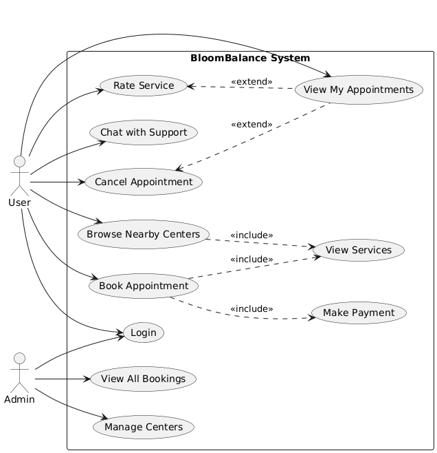

# BloomBalance 

**BloomBalance** is a clean, modern UI/UX prototype built to streamline the booking experience for gyms, spas, and beauty salons. It allows users to explore nearby centers, book services, manage their appointments, and contact support — all through an intuitive and user-friendly interface.

> This project is a **UI prototype only**, created entirely using **Figma**. There is no backend or functional code.

---

##  Features

- Login and user authentication interface (for users and admins)
- Browse nearby wellness centers
- View detailed service listings
- Book appointments with preferred dates and time slots
- Make payments (mock UI only)
- View, cancel, or rate past appointments
- Live chat interface for support
- Admin dashboard to manage centers and view all bookings

---

## Tools Used

- **Figma** – for UI/UX design and prototyping  
- **Draw.io**–  for creating use case diagrams  

---

## Use case digram 

```markdown

```
## Interface


```markdown


